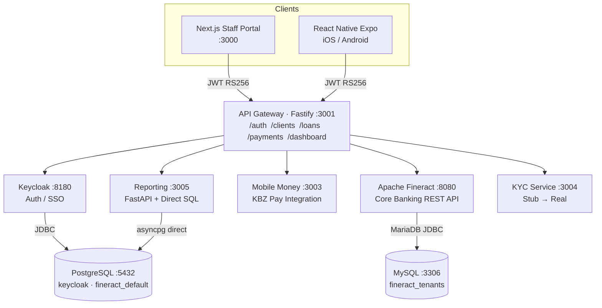
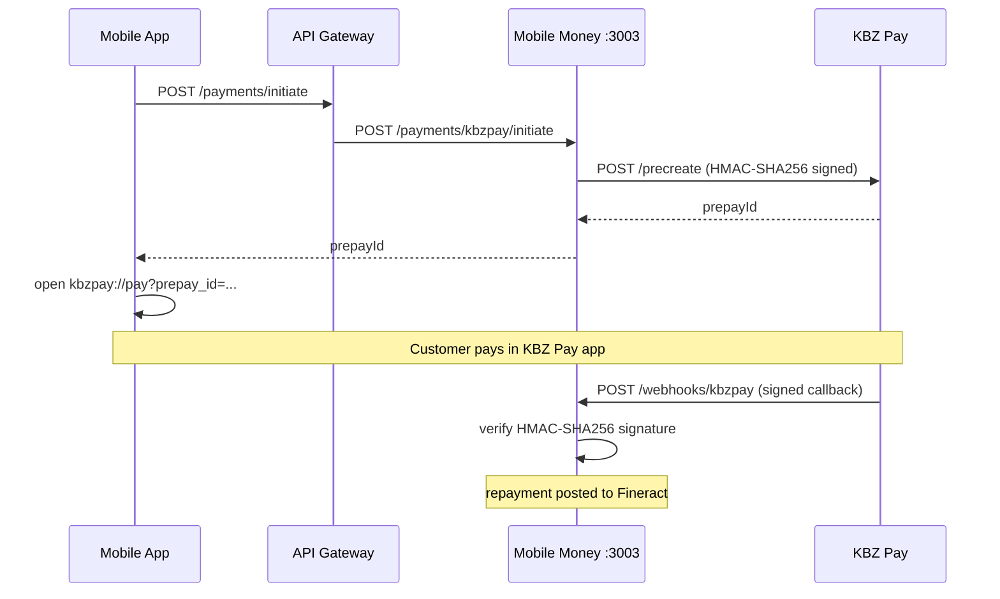

# Mifos X for MM — Full-Stack Microfinance Platform

MifosX4MM helps loan officers and branch managers at a Myanmar microfinance institution manage their entire loan portfolio — from client registration and identity verification through to loan approval, disbursement, and repayment collection via KBZ Pay. It is built on [Apache Fineract](https://fineract.apache.org/) as the core banking engine, with a modern web portal for desk staff and a React Native app for field loan officers. See [docs/DOMAIN.md](docs/DOMAIN.md) for the business context and domain glossary.

---

## Architecture Overview



---

## Stack

| Layer | Technology |
|---|---|
| Core banking | Apache Fineract (Java/Spring Boot) — Docker only, not forked |
| API gateway / BFF | Fastify 4 + TypeScript |
| Web portal | Next.js 14 (App Router, React 18, Tailwind CSS) |
| Mobile app | React Native + Expo Router |
| Mobile money | KBZ Pay direct API (HMAC-SHA256) |
| KYC | Pluggable provider interface (stub → Smile Identity / Onfido) |
| Reporting | Python FastAPI + SQLAlchemy async + asyncpg |
| Auth | Keycloak 24 (JWKS-backed JWT verification in the gateway) |
| Database (Fineract) | MySQL 8.0 — `fineract_tenants` + `fineract_default` |
| Database (auth + reporting) | PostgreSQL 15 — `keycloak` + `fineract_default` |
| Monorepo | Turborepo + pnpm workspaces |
| Dev infra | Docker Compose |

---

## Project Structure

```
mifos-x/
├── apps/
│   ├── api/              Fastify BFF — auth, clients, loans, payments, dashboard
│   ├── web/              Next.js 14 staff portal
│   └── mobile/           Expo React Native field app (iOS + Android)
├── services/
│   ├── mobile-money/     KBZ Pay client — signature, prepay, callback, status
│   ├── kyc/              Provider abstraction — submit, status, webhook, stats
│   └── reporting/        Python FastAPI — portfolio, collections, KYC summaries
├── packages/
│   └── shared-types/     TypeScript interfaces (Fineract, KBZ Pay, KYC, Auth)
├── infra/
│   ├── docker/           Shared Dockerfiles (Node, Python)
│   ├── keycloak/         realm-mifos.json — auto-imported on first boot
│   ├── postgres/         init.sql — creates the keycloak database
│   └── mysql/            init.sql — creates the fineract_default database
├── .env.example          All required environment variables
└── docker-compose.yml    Full dev environment
```

---

## Quick Start

### Prerequisites
- [Docker Desktop](https://www.docker.com/products/docker-desktop/) (for the full stack)
- [Node.js 20+](https://nodejs.org/) + [pnpm](https://pnpm.io/) (for local dev)
- [Python 3.12+](https://python.org/) (for the reporting service only)

### 1 — Clone and install

```bash
git clone https://github.com/kochrisdev/MifosX4MM.git
cd mifos-x
pnpm install
```

### 2 — Configure environment

```bash
cp .env.example .env
# Edit .env and fill in KBZ Pay credentials (see KBZ Pay section below)
```

### 3 — Start infrastructure

```bash
pnpm docker:up
# Starts: PostgreSQL, MySQL, Fineract, Keycloak, and all app services
# Keycloak auto-imports the mifos realm on first boot (~60 s)
# Fineract runs its Liquibase migrations against MySQL (~2-3 min)
```

### 4 — Start all services in dev mode

```bash
pnpm dev
# Starts all apps and services with hot reload
```

### Service URLs

| Service | URL |
|---|---|
| Web portal | http://localhost:3000 |
| API gateway | http://localhost:3001 |
| Fineract | http://localhost:8080/fineract-provider |
| Keycloak admin | http://localhost:8180/admin (admin / admin) |
| Mobile money service | http://localhost:3003 |
| KYC service | http://localhost:3004 |
| Reporting service | http://localhost:3005 |
| PostgreSQL | localhost:5432 |
| MySQL | localhost:3306 |

### Default login credentials

| User | Password | Role | Force change |
|---|---|---|---|
| `admin` | `Admin@1234` | super_admin | Yes |
| `loan.officer` | `Officer@1234` | loan_officer | Yes |

---

## KBZ Pay Integration

KBZ Pay is Myanmar's largest mobile wallet (KBZ Bank). The integration uses direct merchant API (not via 2C2P or Dinger aggregator).

### Credentials

Obtain UAT credentials from KBZ Bank's Transaction Banking Department:
- `KBZPAY_APP_ID`
- `KBZPAY_MERCHANT_CODE`
- `KBZPAY_SIGN_KEY`

Set `KBZPAY_BASE_URL` to KBZ Pay's UAT endpoint during testing, then swap to production.

### Payment flow



See [`services/mobile-money/src/kbzpay/`](services/mobile-money/src/kbzpay/) for implementation.

---

## KYC Abstraction

The KYC service exposes a provider interface (`KycProvider`) so the underlying vendor can be swapped without changing any other service.

| `KYC_PROVIDER` value | Provider | Notes |
|---|---|---|
| `stub` (default) | In-memory stub | Auto-approves after 2 s — for development |
| `smile_identity` | Smile Identity | Africa/Asia national ID verification |
| `onfido` | Onfido | Global document + biometric verification |

To add a new provider: implement `KycProvider` in [`services/kyc/src/providers/`](services/kyc/src/providers/) and add a `case` to `resolveProvider()` in [`services/kyc/src/index.ts`](services/kyc/src/index.ts).

---

## Roles

| Role | Capabilities |
|---|---|
| `super_admin` | Full access to all operations |
| `branch_manager` | Loan approval, disbursal, rejection; all officer capabilities |
| `loan_officer` | Client management, loan origination, repayment collection |
| `teller` | Repayment collection only |
| `customer` | Mobile app self-service (future) |

---

## Documentation

| Document | Contents |
|---|---|
| [docs/DOMAIN.md](docs/DOMAIN.md) | Business context, microfinance concepts, Myanmar context, glossary, user roles |
| [docs/ONBOARDING.md](docs/ONBOARDING.md) | First-week guide: what to run, what to explore, how to trace the code |
| [docs/ARCHITECTURE.md](docs/ARCHITECTURE.md) | Component diagrams, data flows, DB schema, tech decision rationale |
| [docs/API.md](docs/API.md) | Full API reference for all services |
| [docs/DEVELOPMENT.md](docs/DEVELOPMENT.md) | Local setup, env vars, workflows, troubleshooting |
| [docs/CONTRIBUTING.md](docs/CONTRIBUTING.md) | Feature development patterns, testing, known tech debt |
