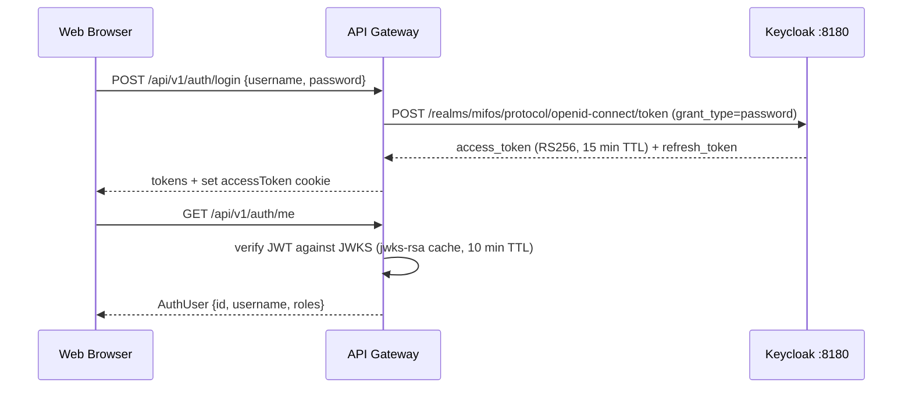
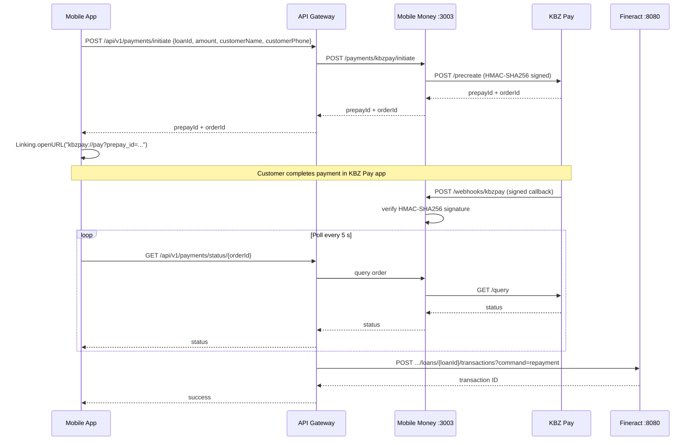
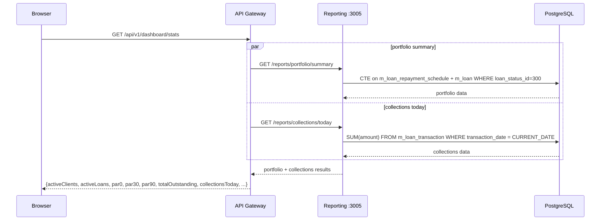
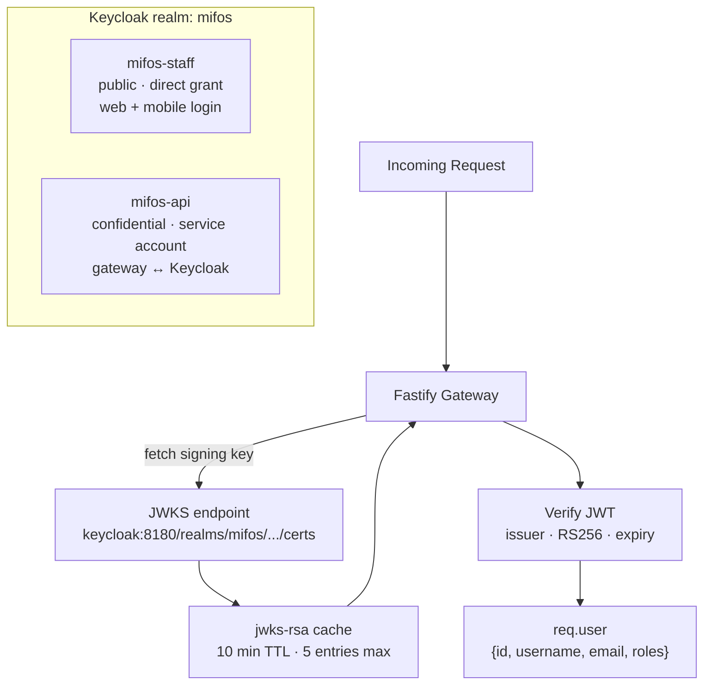
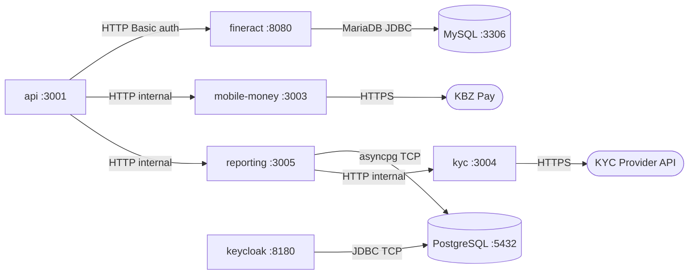

# Architecture

## Design Principles

1. **Fineract as engine, not framework** — Apache Fineract is accessed only through its REST API. It is never forked or modified. All custom business logic lives in the gateway and services layer.
2. **Single source of truth for financial data** — Fineract stores all loan and client data in MySQL (`fineract_tenants`). The reporting service queries PostgreSQL (`fineract_default`) directly for accuracy rather than re-deriving figures from the REST API. Keycloak also uses PostgreSQL for its own schema.
3. **Pluggable third-party integrations** — KYC providers and payment methods implement typed interfaces. Swapping vendors requires adding one file, not refactoring call sites.
4. **JWT-first auth** — All protected routes verify RS256-signed JWTs against Keycloak's JWKS endpoint. No API keys are passed between services in the hot request path.

---

## Component Responsibilities

### `apps/api` — API Gateway (Fastify)

The single entry point for all clients (web, mobile). Responsibilities:

- **Auth**: validates Keycloak JWTs; exposes `POST /auth/login`, `/auth/refresh`, `/auth/logout`
- **RBAC**: `authorize(['branch_manager', 'super_admin'])` decorator enforces role checks at the route level
- **Fineract proxy**: transforms Fineract's verbose responses into clean paginated shapes
- **Payment orchestration**: calls the mobile-money service to create KBZ Pay orders; posts confirmed repayments back to Fineract
- **Dashboard aggregation**: fans out to the reporting service for portfolio and collections stats

### `apps/web` — Staff Portal (Next.js 14)

- App Router with server components for layout; client components for data-fetching pages
- React Query handles all data fetching with 30 s stale time and 1-minute auto-refresh on the dashboard
- `src/middleware.ts` guards all routes — redirects to `/login` if the `accessToken` cookie is absent
- Silent token refresh on 401 via axios interceptor

### `apps/mobile` — Field App (Expo React Native)

- Expo Router (file-based navigation) with `(auth)` and `(tabs)` route groups
- `AuthContext` handles login state; `NavigationGuard` redirects unauthenticated users
- Tokens persisted in `AsyncStorage`; silent refresh on 401 mirrors web behaviour
- KBZ Pay payment initiated via `Linking.openURL("kbzpay://pay?prepay_id=...")`, with 5-second polling on return

### `services/mobile-money` — KBZ Pay Service (Fastify)

- `KbzPayClient` encapsulates all KBZ Pay API calls: `createOrder`, `queryOrder`, `parseCallback`
- Signature utility (`HMAC-SHA256`) is isolated in `kbzpay/signature.ts` and tested separately
- Exposes three routes: initiate, status query, and the webhook receiver
- The webhook verifies signature before trusting payload; logs mismatches without crashing

### `services/kyc` — KYC Service (Fastify)

- `KycProvider` interface has four methods: `submit`, `getStatus`, `handleWebhook`, `getStats`
- `StubKycProvider` keeps an in-memory map; auto-approves after 2 s for development
- Real providers (Smile Identity, Onfido) implement the same interface; active provider is selected by `KYC_PROVIDER` env var at startup

### `services/reporting` — Reporting API (Python FastAPI)

- Connects directly to PostgreSQL (`fineract_default`) via SQLAlchemy async + asyncpg
- **No Fineract REST calls** — all financial figures come from direct SQL for accuracy and performance
- PAR calculations use a CTE on `m_loan_repayment_schedule` to find loans with unpaid past-due installments
- KYC summary is fetched from the KYC service via httpx (that data lives in the KYC service, not Fineract's DB)

---

## Key Data Flows

### 1. Staff Login



### 2. Loan Repayment via KBZ Pay



### 3. KYC Submission

```mermaid
sequenceDiagram
    participant Off as Loan Officer (Mobile)
    participant GW as API Gateway
    participant KYC as KYC Service :3004
    participant Prov as KYC Provider
    participant RPT as Reporting Service

    Off->>GW: POST /api/v1/kyc/submit {clientRef, documentType, images}
    GW->>KYC: Provider.submit()
    Note over KYC,Prov: stub: auto-approves after 2 s / real: Smile Identity or Onfido API
    KYC-->>GW: submissionId + status: "processing"
    GW-->>Off: submissionId + status: "processing"
    Prov-->>KYC: POST /webhooks/kyc {submissionId, status: "approved"} (async)
    Note over KYC: future: update Fineract client document status
    RPT->>KYC: GET /kyc/stats
    KYC-->>RPT: {pending, processing, approved, rejected, manual_review, total}
```

### 4. Dashboard Stats Load



---

## Database Schema (Key Tables)

All tables are in Fineract's MySQL database (`fineract_default`, `public` schema). The reporting service queries these same table names via the PostgreSQL `fineract_default` database.

### `m_loan` — Loan accounts

| Column | Type | Notes |
|---|---|---|
| `id` | BIGINT | PK |
| `account_no` | VARCHAR | Human-readable reference |
| `client_id` | BIGINT | FK → m_client |
| `product_id` | BIGINT | FK → m_product_loan |
| `loan_status_id` | SMALLINT | **300** = Active, 600 = Closed |
| `principal_disbursed_derived` | DECIMAL | Actual disbursed amount |
| `principal_outstanding_derived` | DECIMAL | Outstanding principal |
| `total_outstanding_derived` | DECIMAL | Total outstanding (principal + interest + fees) |
| `disbursedon_date` | DATE | Actual disbursal date |
| `currency_code` | VARCHAR | e.g. `MMK` |

### `m_loan_repayment_schedule` — Installment schedule

| Column | Type | Notes |
|---|---|---|
| `loan_id` | BIGINT | FK → m_loan |
| `duedate` | DATE | Installment due date |
| `completed_derived` | BOOLEAN | True when installment is fully paid |
| `obligations_met_on_date` | DATE | Date paid (NULL if unpaid) |
| `principal_amount` | DECIMAL | Principal due this installment |
| `interest_amount` | DECIMAL | Interest due |
| `principal_completed_derived` | DECIMAL | Principal paid |
| `interest_completed_derived` | DECIMAL | Interest paid |

### `m_loan_transaction` — All loan movements

| Column | Type | Notes |
|---|---|---|
| `loan_id` | BIGINT | FK → m_loan |
| `transaction_type_enum` | SMALLINT | **1** = Disbursement, **2** = Repayment |
| `transaction_date` | DATE | Effective date |
| `amount` | DECIMAL | Transaction amount |
| `is_reversed` | BOOLEAN | True if reversed |
| `manually_adjusted_or_reversed` | BOOLEAN | True if manually adjusted |

### `m_client` — Borrower records

| Column | Type | Notes |
|---|---|---|
| `id` | BIGINT | PK |
| `account_no` | VARCHAR | Human-readable reference |
| `display_name` | VARCHAR | Full display name |
| `status_enum` | INT | 300 = Active |
| `office_id` | BIGINT | FK → m_office (branch) |
| `mobile_no` | VARCHAR | Phone number |

---

## PAR Calculation Method

PAR (Portfolio at Risk) is calculated using a CTE that identifies the **oldest unpaid past-due installment** per loan.

```sql
WITH overdue_schedule AS (
    SELECT
        loan_id,
        MIN(duedate)                AS oldest_overdue_date,
        CURRENT_DATE - MIN(duedate) AS days_in_arrears,
        SUM( /* unpaid amounts */ ) AS overdue_amount
    FROM m_loan_repayment_schedule
    WHERE duedate < CURRENT_DATE
      AND completed_derived = false
      AND obligations_met_on_date IS NULL
    GROUP BY loan_id
)
-- PAR30 = outstanding of loans where days_in_arrears >= 30
--         / total active portfolio outstanding * 100
```

This is more accurate than Fineract's REST-derived `inArrears` flag, which only updates after a scheduled batch job runs.

---

## Auth Architecture



Token lifetimes (configurable in Keycloak):
- Access token: **15 minutes**
- SSO session: **10 hours**
- Clients handle silent refresh on 401

---

## Service Communication



All inter-service calls are on the `mifos_net` Docker bridge network in development. In production, replace with a service mesh or internal load balancer.

---

## Why these choices?

| Decision | Rationale |
|---|---|
| **Apache Fineract** | Battle-tested open-source core banking engine used by MFIs in 40+ countries. Handles amortization schedules, interest accrual, GL accounting. Accessed only via REST — never forked — so Docker image upgrades are safe. |
| **Keycloak (ROPC flow)** | Enterprise OIDC provider. ROPC is appropriate for a closed staff portal (no "Login with Google" needed). RS256 JWT lets every service verify tokens via the JWKS endpoint without a database round-trip per request. |
| **Python for reporting** | Fineract REST does not expose PAR or time-series aggregations at the needed accuracy. Direct SQL via asyncpg gives real-time figures from `m_loan_repayment_schedule`. Isolated from the Turborepo TypeScript pipeline by design. |
| **KBZ Pay direct API** | Myanmar's largest mobile wallet with deepest rural penetration. Direct merchant API (not via 2C2P or Dinger aggregator) avoids aggregator fees and provides direct access to webhooks and settlement reports. |
| **Turborepo + pnpm workspaces** | All TypeScript services share `@mifos-x/shared-types`. Turborepo provides dependency-aware build ordering and parallel dev server startup with a single `pnpm dev` command. |
